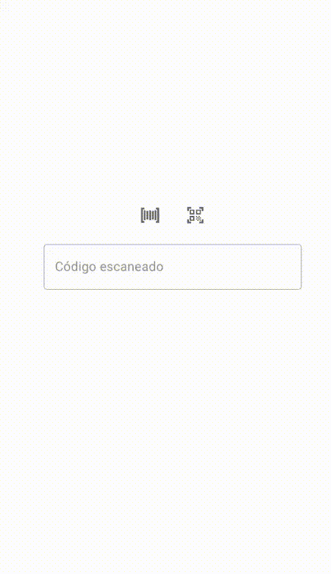
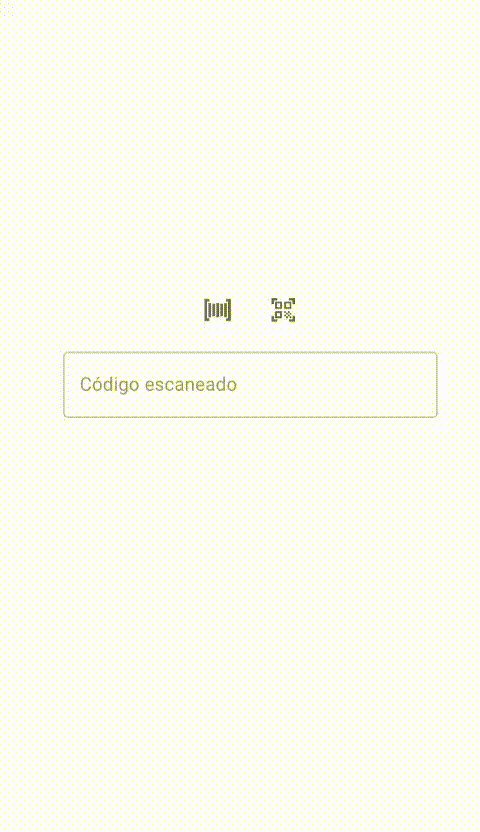
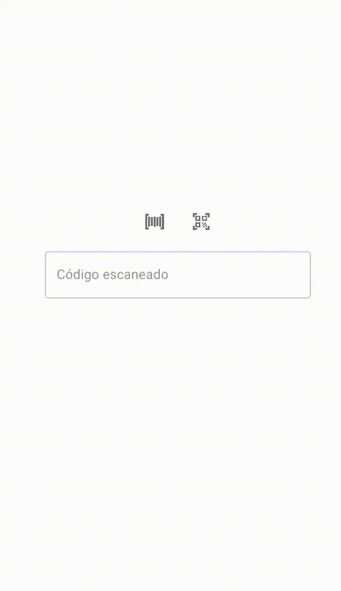

# 📱 Leitor de Código de Barras e QR Code

[](https://www.gnu.org/licenses/agpl-3.0)
[](https://reactjs.org/)
[](https://mui.com/)

Aplicação web para leitura de códigos de barras e QR codes utilizando a câmera do dispositivo. Desenvolvida com React e Material-UI, otimizada para dispositivos móveis.

🌐 **Acesse a aplicação:** https://gorinformaticadev.github.io/leqr.io

## 🚀 Funcionalidades

- ✅ Leitura de códigos de barras (diversos formatos)
- ✅ Leitura de QR codes
- ✅ Interface responsiva e moderna
- ✅ Otimizado para dispositivos móveis
- ✅ Acesso seguro via HTTPS
- ✅ Deploy automático no GitHub Pages

## 📱 Demonstração

### Código de Barras
<p align="center">
  
  
</p>

### QR Code
<p align="center">
  
</p>

## 🛠️ Tecnologias

- **React 18.2.0** - Biblioteca JavaScript para interfaces
- **Material-UI 5.15.0** - Design system e componentes
- **Quagga.js** - Biblioteca para leitura de códigos de barras
- **React QR Reader** - Biblioteca para leitura de QR codes
- **GitHub Pages** - Hospedagem e deploy automático

## ⚙️ Instalação e Execução

### Pré-requisitos
- Node.js 16+ 
- Yarn ou npm

### Comandos
```bash
# Clonar o repositório
git clone https://github.com/gorinformaticadev/leqr.io.git
cd leqr.io

# Instalar dependências
yarn install

# Executar em desenvolvimento
yarn start

# Fazer build para produção
yarn build

# Deploy para GitHub Pages
yarn deploy
```

### Desenvolvimento Local
Para desenvolvimento local com acesso à câmera:
- Configure HTTPS usando [mkcert](https://github.com/FiloSottile/mkcert)
- A aplicação funciona melhor em dispositivos móveis
- Certifique-se de que o navegador tenha permissão para acessar a câmera

## 📄 Licença

Este projeto está licenciado sob a **GNU Affero General Public License v3.0 (AGPL-3.0)**.

Você pode usar, modificar e distribuir este software, mas deve:
- Manter o código fonte disponível
- Incluir a mesma licença em trabalhos derivados
- Disponibilizar o código fonte se hospedar o serviço

Veja o arquivo [LICENSE](LICENSE) para mais detalhes.

## 👥 Créditos

### Autor Original
- **Felipe Brenner** - Implementação inicial e conceito

### Adaptação e Melhorias
- **GOR Informática** - Adaptação para GitHub Pages e melhorias
  - 🌐 Website: [gorinformatica.com.br](https://gorinformatica.com.br)
  - 📱 WhatsApp: [(61) 3359-7358](https://wa.me/556133597358)

### Bibliotecas Utilizadas
- [Quagga.js](https://github.com/serratus/quaggaJS) - Leitura de códigos de barras
- [React QR Reader](https://github.com/JodusNodus/react-qr-reader) - Leitura de QR codes
- [Material-UI](https://mui.com/) - Design system

## 🤝 Contribuições

Contribuições são bem-vindas! Sinta-se à vontade para:
- Reportar bugs
- Sugerir melhorias
- Enviar pull requests

---

<p align="center">
  <strong>GOR Informática</strong>
</p>
